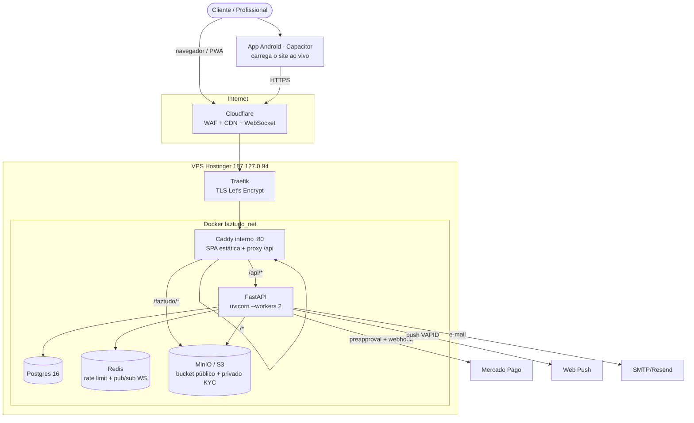
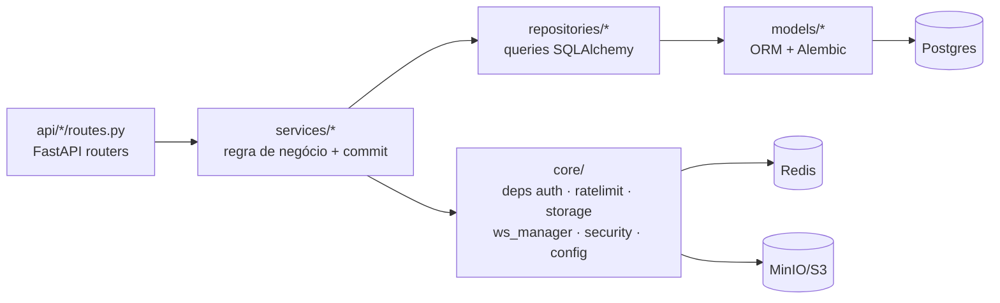
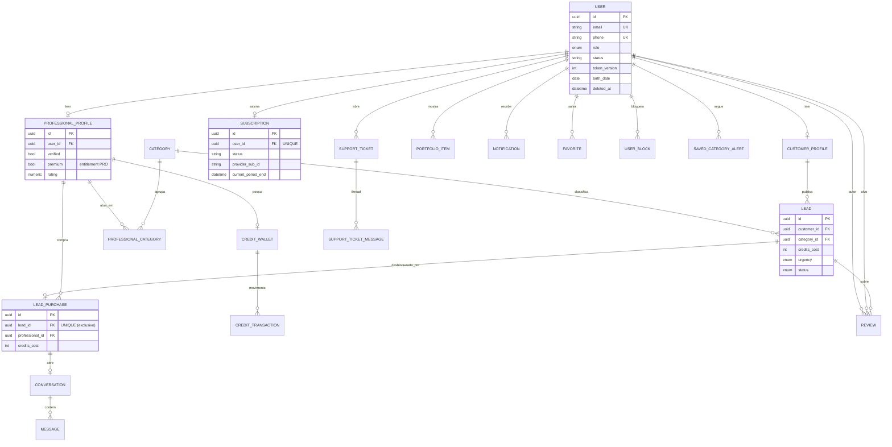
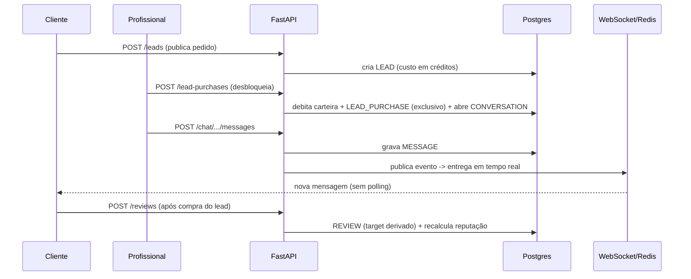

# FazTudo — Arquitetura & UML

Visão de arquitetura do FazTudo (marketplace de serviços locais por créditos).
Diagramas em **Mermaid** (renderizam direto no GitHub). Documento vivo — expandir
conforme o sistema evolui. Esteira #14.

Stack: **FastAPI** (async, SQLAlchemy 2 + Alembic) · **Next.js 14** (export
estático) · **Postgres 16** · **Redis** · **MinIO/S3** · **Capacitor** (Android).
Em produção atrás de **Cloudflare → Traefik → Caddy**.

---

## 1. Implantação (deployment)

---

## 2. Camadas do backend

Padrão por feature: **model → schema (Pydantic v2) → repository → service →
routes**. Exceções de domínio viram HTTP no handler global. RBAC por
`require_roles` + `active_role` (papel duplo cliente/profissional).

---

## 3. Domínio principal (ER)

> **Invariantes-chave:** lead é **EXCLUSIVO** (`UNIQUE lead_id` em
> `lead_purchases`); saldo só muda via `CreditTransaction`; `target_id` da
> avaliação é derivado no backend (anti-IDOR); `premium` é a fonte de verdade do
> entitlement da assinatura.

---

## 4. Fluxo: comprar lead → conversar → avaliar

---

## 5. Background workers & integrações

| Worker / Integração | O quê |
|---|---|
| Reciclo de leads | Devolve ao mercado lead comprado e não contatado a tempo |
| Win-back | Push para inativos (>14d) que aceitam marketing (cooldown) |
| WS listener | Consome canal Redis e entrega chat em tempo real (1/worker) |
| Mercado Pago | Crédito avulso (Checkout Pro) + assinatura (preapproval) via webhook |
| Backup | `scripts/backup-db.sh` no cron diário (mantém 3) |
